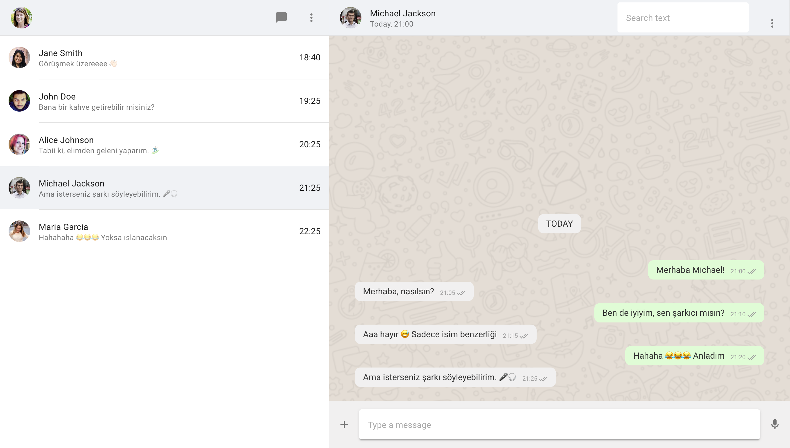
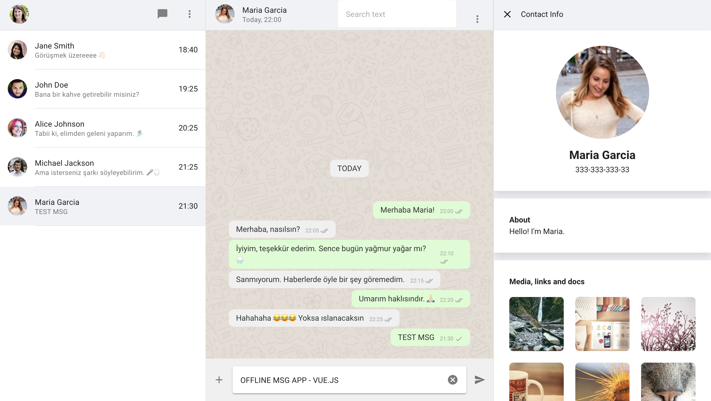

# Chat Application with VUE3 & Vuetify & Pinia




## Proje Açıklaması

Bu proje, Vue.js Composition API kullanılarak geliştirilmiş bir offline chat uygulamasını içerir. Mock kullanıcılar ile mesajlaşabilir, kullanıcı detaylarına bakabilirsiniz.

**Teknolojiler:** Vue.js 3, Vuetify, Pinia

**Demo:** [Canlı Demo](https://chat-app-vue3-iota.vercel.app/)

## Kurulum

Projeyi çalıştırmak için aşağıdaki adımları izleyin:

1. Bu projeyi klonlayın.
   ```bash
   git clone https://github.com/mfcandan/ChatAppVue3.git

2. Proje klasörüne gidin.
    ```bash
    cd ChatAppVue3

3. Node Modüllerini yükleyin.
    ```bash
    npm install

5. Projeyi başlatın
    ```bash
    npm run dev

6. Tarayıcınızda http://localhost:3000 adresinde çalışacaktır.
